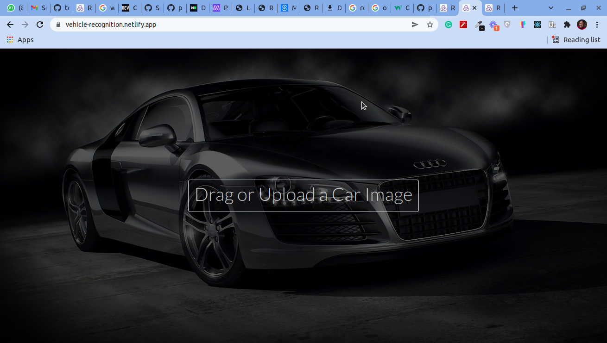

# Vehicle Recognition

This is a Vehicle image detection Web App, that takes an image and detects if it contains a car and gives results to users.
  

## Live demo
[vehicle-recognition](https://vehicle-recognition.netlify.app/)

## Demo Video
[Loom Video](https://www.loom.com/share/1d615d68af5441f9bfa816bfc4269167)

## Built With

- React

- CSS

- Boostrap

- Redux

- Visual Studio Code

- Git & Github

## Getting Started
To get a local copy up and running follow these simple example steps.

### Setup
* Open terminal
* Clone this project by command git clone(https://github.com/peterdgreat/vehicle-recognition.git)
* Cd vehicle-recognition

### install
Run the following command to have all npm packages dependencies installed:

yarn install

### Usage

To start the webpack-dev-server, run the following command:

yarn start

## Authors

👤 **Ajayi Peter**

- GitHub: [@peterdgreat](https://github.com/peterdgreat)
- Twitter: [@dev_Peter_0](https://twitter.com/dev_Peter_O)
- LinkedIn: [ajayi-peter](https://linkedin.com/in/ajayipeter)

## Show your support

Give a ⭐️ if you like this project!

## Acknowledgments
- Hat tip to anyone whose code was used
- Inspiration
- etc
